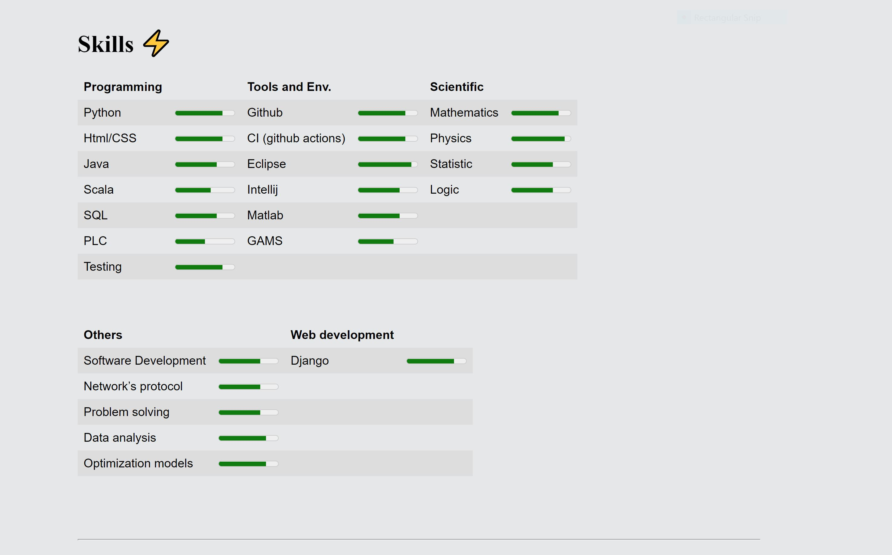
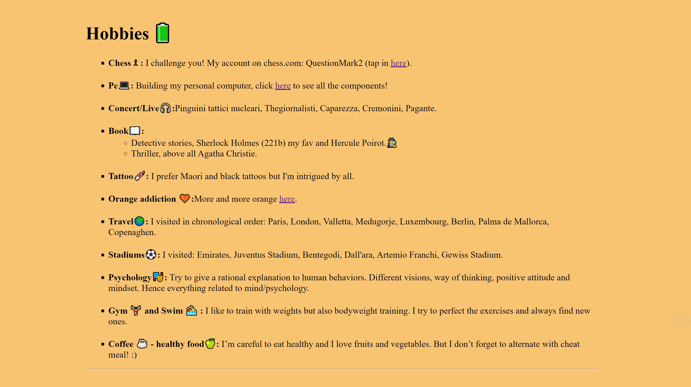
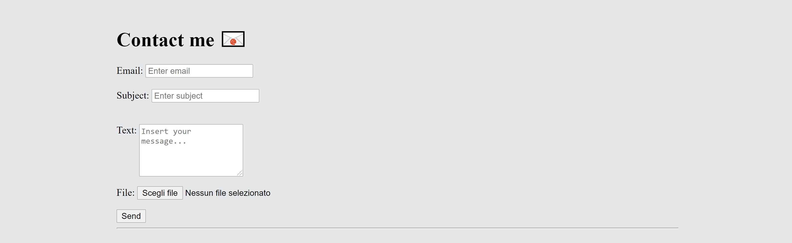

# Personal_Portfolio

 
## Introduction
My personal static website in html/css. 

## Features
My  portfolio  

## Snapshot

## Diritti di autore icon
Icons made by <a href="https://www.flaticon.com/authors/freepik" title="Freepik">Freepik</a> from <a href="https://www.flaticon.com/" title="Flaticon"> www.flaticon.com</a>

